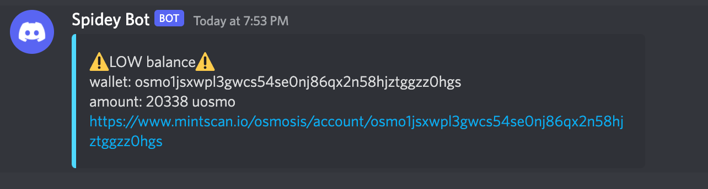

# onlooker

> *someone who watches something that is happening in a public place*

Cosmos wallet amount alerting

> Supported chains <https://github.com/cosmos/chain-registry>

## Usage

It'll check for `onlooker.yaml` in home or working directory

```yaml
# onlooker.yaml

- chainName: osmosis
  chainId: osmosis-1
  walletAddress: osmo1jsxwpl3gwcs54se0nj86qx2n58hjztggzz0hgs
  amount: 1000000 # minimum balance before alert (as per zero exponential denom)
  duration: 6h    # balance checking duration
  notify:
    # shoutrrr based URLs https://containrrr.dev/shoutrrr/v0.5/services/discord/
    - telegram://...
    - discord://...
...
```



## Development

```shell
make install
```

> Notes:
> * Running it many times at once may lead to rate limit from github side since
> it'll scrap chain list from <https://github.com/cosmos/chain-registry>
>
